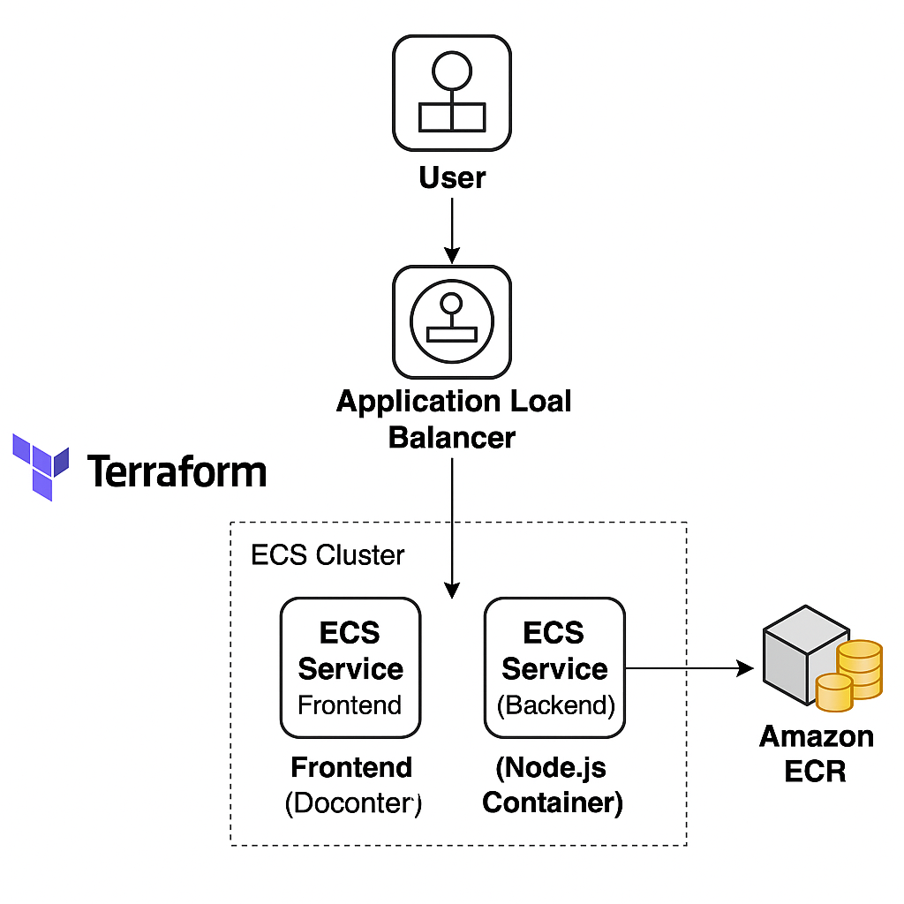

# Fullstack App on AWS ECS with Terraform

This project is a fullstack Todo application developed using React (frontend) and Node.js (backend), containerized using Docker, and deployed on AWS using ECS Fargate. Infrastructure is fully provisioned using Terraform, showcasing modern DevOps practices and cloud-native deployment.

## Tech Stack

- Frontend: React.js
- Backend: Node.js, Express
- Containerization: Docker
- Cloud Provider: AWS
- Container Orchestration: ECS Fargate
- Infrastructure as Code: Terraform
- Load Balancer: Application Load Balancer (ALB)
- Optional: RDS / DynamoDB (if used)

## Architecture

